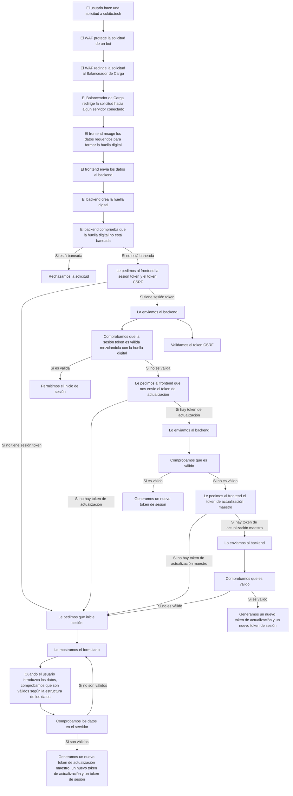

# Blog de Cukito

El blog de Cukito es un blog que utiliza Next.js para el frontend y Rust para el backend. Es posible desplegarlo en cualquier lugar que soporte Docker.

## Características

- **Rápido**: El frontend está construido con Next.js, que es un framework de React que permite la renderización del lado del servidor. El backend está construido con Rust, que es un lenguaje rápido.
- **Fácil de desplegar**: El blog está construido con Kubernetes, por lo que puede desplegarse en cualquier lugar que soporte Kubernetes. Vamos a desplegarlo en AWS EKS.
- **Seguro**: El blog está construido con Rust, que es un lenguaje seguro. El frontend está construido con Next.js, que es un framework seguro.
- **Fácil de usar**: El blog está construido con Next.js, que es un framework de React fácil de usar. El backend está construido con Rust, que es un lenguaje fácil de usar.
- **Escalable**: El blog está construido con Kubernetes, por lo que puede escalarse fácilmente. Y la base de datos también puede escalarse fácilmente.
- **Código abierto**: El blog es de código abierto, por lo que puedes usarlo gratuitamente.
- **Personalizable**: El blog está construido con Next.js, por lo que es fácil de personalizar.
- **Amigable con SEO**: El blog está construido con Next.js, que es un framework de React amigable con SEO.
- **Amigable con dispositivos móviles**: El blog está construido con Next.js, que es un framework de React amigable con dispositivos móviles.

## Stack tecnológico

- **Frontend**: Next.js
- **Backend**: Rust + Axum
- **Base de datos**: PostgreSQL
- **Despliegue**: Kubernetes
- **CI/CD**: GitHub Actions
- **Monitoreo + Registro + Trazado + Visualización**: OTEL-LGTM stack
- **Gestión de secretos**: AWS Secrets Manager / Azure Key Vault
- **Almacenamiento**: Cloudflare R2
- **CDN**: Cloudflare
- **DNS**: Cloudflare
- **SSL**: Cloudflare
- **WAF (firewall)**: Cloudflare / AWS WAF
- **Autenticación**: Backend en Rust + base de datos PostgreSQL.

## Flujo de Autenticación

El flujo de autenticación para la aplicación está diseñado para asegurar el acceso seguro y prevenir acciones no autorizadas. A continuación se muestra un diagrama detallado que describe el proceso de autenticación, incluyendo la protección contra CSRF:

Este flujo asegura que el usuario esté autenticado de manera segura antes de acceder a cualquier dato sensible o realizar acciones como cambiar suscripciones. La inclusión de la validación del token CSRF proporciona una capa adicional de seguridad.

## Apps

- **Web**
- **API**
- **LGTM**
- **Docs**

## Roles

Ordered by jerarchy:

- **Admin**: Can create, update and delete posts.
- **Editor**: Can read posts, comment, write posts and supervise posts.
- **Writer**: Can read posts, comment and write posts but need a verification.
- **Moderator**: Can read posts, comment and moderate comments.
- **Subscriptor**: Can read posts and comment withouth ads.
- **User**: Can read posts and comment.
- **Guest**: Can read posts.
